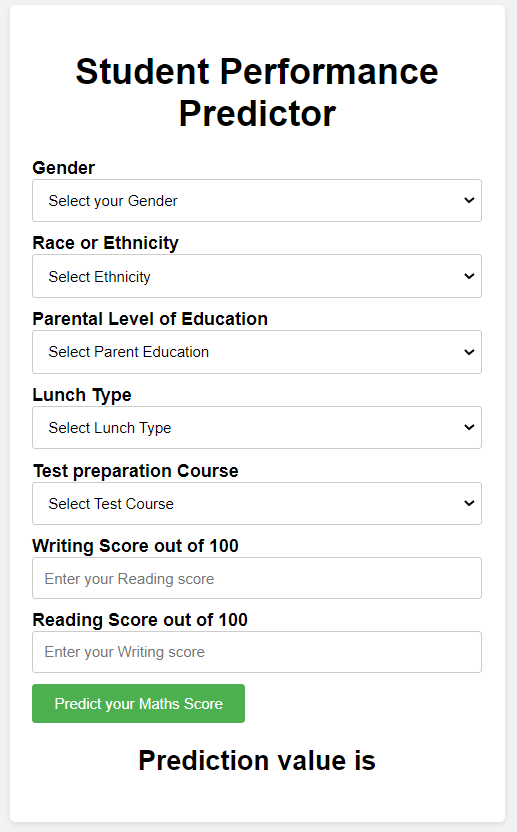

# Student Performance Prediction

### Introduction About the Data :

The goal is to predict `math_score` of given student (Regression Analysis).

There are 7 independent variables:

* `gender` : gender of the student.
* `race_ethnicity` : race and ethinicity of the group divided into groups.
* `parental_level_of_education` : parental education details.
* `lunch` : selected lunch option for the student.
* `test_preparation_course` : did student completed the course required for the course.
* `reading_score` : score obtained in reading part.
* `writing_score` : score obtained in writing part.

Target variable:
* `math_score`: score obtained in writing part.

Dataset Source Link :
[https://www.kaggle.com/datasets/spscientist/students-performance-in-exams](https://www.kaggle.com/datasets/spscientist/students-performance-in-exams)

# AWS Deployment Link :

* There is an issue related to AWS Elastic Bean Stalk, trying to resolve the issue. 
* Code is succesfully getting deployed using the AWS pipeline and getting deployed on AWS EBS. 
* The URL for EBS is not working.

# Screenshot of UI

# Approach used in the project 

1. Data Ingestion : 
    * The data is first read as csv during the Data Ingestion phase. 
    * The data is then divided into training and testing groups and saved as a csv file.

2. Data Transformation : 
    * In this phase a ColumnTransformer Pipeline is created.
    * For Numeric Variables first SimpleImputer is applied with strategy median , then Standard Scaling is performed on numeric data.
    * for Categorical Variables SimpleImputer is applied with most frequent strategy, then one hot encoding is performed , after this data is scaled with Standard Scaler.
    * This preprocessor is saved as pickle file.

3. Model Training : 
    * In this phase base model is tested .
    * After this hyperparameter tuning is performed.
    * A final model is created with best accuracy.
    * This model is saved as pickle file.

4. Prediction Pipeline : 
    * This pipeline converts given data into a dataframe and includes functions for loading pickle files and predicting final results in Python.

5. Flask App creation : 
    * Flask Application is created with a UI to predict the Student score based on the given input.
